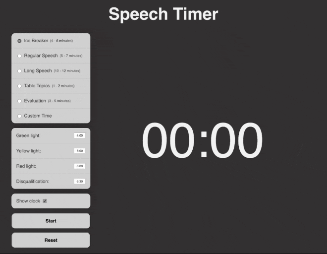

# Speech Timer
---

**Speech Timer** is a web-based timing tool that caters to the speech timing formats used by [Toastmasters International](https://www.toastmasters.org/)

To use this timer, select the speech format you are timing for, customize the times if desired, and click the "Start" button.  The screen will change colors (green, yellow, and red) at each indicated time intervals.

This tool is built using HTML, CSS, and vanilla JavaScript.

Live site: [Speech Timer](https://paulcrescini.dev/examples/timer/)